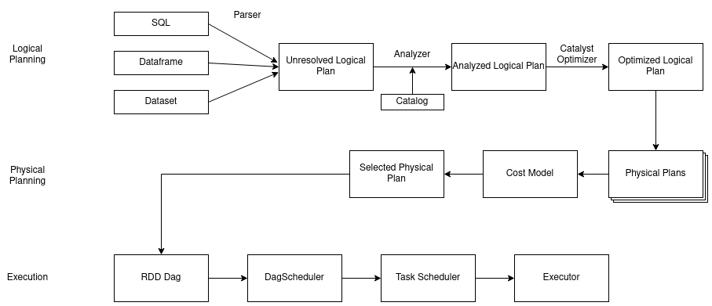
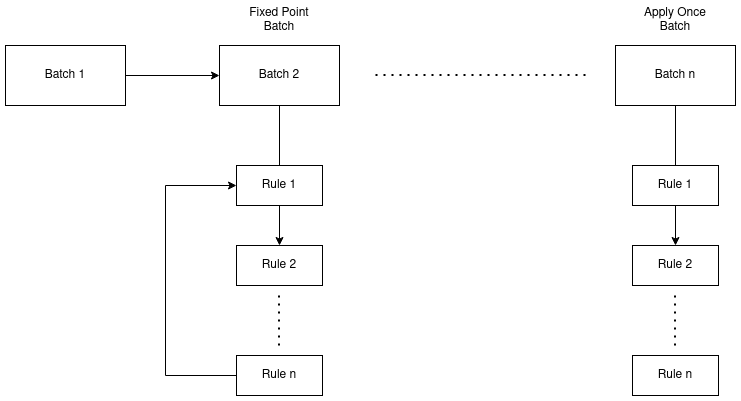
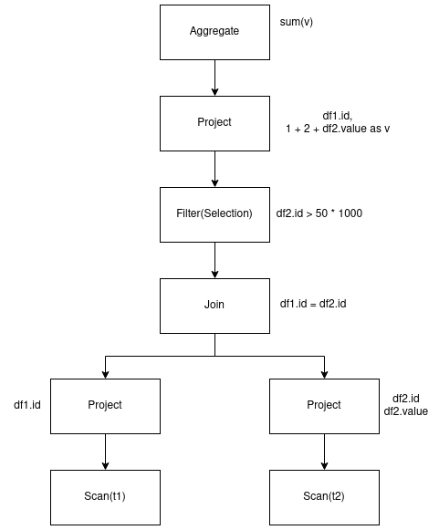

**Apache Spark** is a fast data processing engine dedicated to Big data, it allows carrying out processing on large 
volumes of data in a parallel and distributed manner using Map/Reduce programming paradigm.

Many of us already know about Spark, but we often get confused with Spark's architecture and some 
key concepts associated with it.

# Spark Basic Architecture

Spark's architecture is a Master-Slave Architecture, and it consists of three components : Driver, Cluster Manager and Executors.

<p align="center">
    
</p>
<p align="center">
    <em>Spark Basic Architecture</em>
</p>

Driver has multiple responsibilities : 
- Analyzes, distributes and schedules work across the executors
- Monitors Spark Application

While executors are responsible for processing the data that the driver assigns them.

Later, on the [Spark In Depth Architecture] chapter, we'll what's the responsibilities of the cluster manager and see how all these components work together.

# Partitioning

Before Spark, we used HDFS MapReduce to process Big Data, in a nutshell, data is split into Blocks (or partitions), 
each block is stored into a worker node (or data node) and is replicated on other nodes for fault tolerance, 
when processing this data, each worker processes the data he stores. 

<p align="center">
    
</p>
<p align="center">
    <em>Spark Partitions</em>
</p>

Spark partitions works the same, they're logical chunks of data split across executor's RAM.

So basically, each partition will be processed by one executor, and each executor will process one or more partitions.

# Shuffling

Data shuffling is that operation requiring data exchanges between Spark Workers.
For example, a join operation between two datasets would require a Shuffle if these two datasets partitions does not live on the
same worker node.

One of the performance issues in parallelized processing relies on shuffles because they require network transfer.

# Spark Memory Abstraction

Hadoop MapReduce used to store intermediate iteration results in disk (as show in the picture below), this process was really slow as it involves read/writes from disk each iteration.
Plus, it is not suitable for some applications, especially those that reuse data through multiple operations such as most statistical learning algorithms, most of which
are iterative, and requires shuffles operations across the cluster (joins for example). Shuffle operations on HDFS MapReduce were so resource consuming that it limited the potential of this distributed architecture.

<p align="center">
    
</p>
<p align="center">
    <em>HDFS Data Processing</em>
</p>

The success of the Spark framework against the MapReduce implementation on Hadoop is due to its in-memory processing which will lead to cheaper Shuffle
steps. Indeed, MapReduce does several disk reads/writes while Spark limits many of them and stores the intermediate step data in memory.

<p align="center">
    
</p>
<p align="center">
    <em>Spark Data Processing</em>
</p>

Spark does that using a memory abstraction called RDD, or Resilient Distributed Dataset.

## RDDs

Spark does that using a memory abstraction called RDD, or Resilient Distributed Dataset. It's a read-only data collection 
partitioned and distributed across cluster nodes.
RDD was created to solve the problem that iterative algorithms and interactive computations pose to MapReduce.

It acts as a data sharing abstraction in a cluster. When we talk about "distributed" in the definition of RDD, 
we are actually referring to "shared", atomic, because it uses cache memory to persist data in RAM for reuse, 
thus avoiding data replication to disk, which is necessary in Hadoop to ensure cluster fault tolerance. Thanks to 
this mechanism, Spark is able to provide fault tolerance and high performance.

Since an RDD is an abstraction, it has no real existence, so it must be explicitly created or instantiated 
through deterministic operations on existing data files or on other RDD instances. These operations are 
called [transformations][transformations].

### Key features

Spark being designed in Scala, it was obvious that RDDs, as collections, inherits the characteristics of the Scala language collections (array, list, tuple, etc) :
- Lazy computations: computations performed on RDDs are "lazy". This means that spark executes expressions only when they are needed. Technically, it is when an action operation is triggered on the RDD that it is executed. This greatly improves the performance of the application
- Immutable: RDDs are immutable. This means that they are only accessible in read mode. It is therefore not possible to modify an RDD. This feature is very useful when managing concurrent access to data, especially in a context of large-scale data valuation
- In-memory: RDDs are executed in memory. They can also be persisted in cache for more speed. Spark developers have provided the ability to choose where to persist RDDs (either on disk, in cache, or in memory and on disk) using the Storage.LEVEL property
- Functional Programming: Operations done on RDD are functional. Plus, RDDs are Monads (I'll be writing an article about monads soon)
- Type Safety: RDDs are type-safe

In addition to that, RDDs have some other features that you have probably guessed from my explanations :
- Distributed: RDDs uses MapReduce paradigm to process large collections of data in parallel and in a distributed manner
- Fault Tolerant: Since RDDs are distributed into **partitions**, it's quite easy to restore lost data in case of node failure. Indeed, instead of replicating the data as HDFS does, RDDs rely on **[Data Lineage]** to restore lost data.

### Limitations

The biggest limitation of RDDs is that they don't support any Optimization engine, developers needs to optimize each operation done on the RDDs.

Plus, RDDs doesn't handle Schemas, if you want your data to be structured, you have to handle that yourself.

## Dataframes

Dataframes were introduced at Spark 1.3 (I think), they're based on RDDs and their goal is to overcome the RDDs limitations.

Dataframes are just like RDDs, a distributed collection of data, but, DFs are organized into columns (they must have a schema).

### Key features

Dataframes have key features of RDDs beside TypeSafety. But, they offer more interesting features :
- Column Organization: as I said, Dataframes are distributed collection of data organized into named columns. It is conceptually equivalent to a table in a relational database
- Handles Heterogeneous data: Dataframes comes with an API that allows us to process structured and unstructured data
- Optimization: Dataframes have metadata which allows makes them compatible with optimization frameworks like Tungsten and Catalyst

### Limitations

Dataframes sadly doesn't support compile time type safety, so if you're not sure about the structure of the Data you're manipulating, you'll probably get runtime erros with Dataframes.

Also, they cannot really operate with domain objects, what I mean by that, is when you've class objects that serialize some Data, and then you create a Dataframe from that class objects, you cannot retrieve back your objects.

Below a Scala example illustrating this use case :
```
case class Car(brand : String , name : String, maxSpeed : Int)
val carsRdd = sc.makeRDD(Seq(Car("Toyota", "Supra", 300), Car("Nissan", "GTR-R32", 300)))
val carsDf = sqlContext.createDataFrame(carsRdd)
carsDf.rdd // returns RDD[Row] , does not returns RDD[Car]
```

## Datasets

Dataset is an extension of the Dataframe API and it provides a type-safe, object-oriented programming interface.
It is a strongly-typed, immutable collection of objects that are mapped to a relational schema.

### Key features

Dataset provides best of both worlds from RDDs and Datasets:
- RDDs: functional programming, type-safety, etc
- Dataframes : Schema (relational model), query optimization, tungsten, etc

Plus, they handle domain objects, thanks to **Encoders** (I'll dedicate an article to encoders). Using Encoders, Datasets can convert JVM objects into Datasets and vice-versa.

### Limitations

The downside of Datasets is that they require specifying the classes fields as Strings. Once you query the data, you can convert it to the proper data type.

``` 
dsCars.select(col("brand").as[String], $"maxSpeed".as[Int]).show
```

# Transformations and Actions

We've seen that RDDs are lazy evaluated which makes the execution of processing fast and thus divides the operations to be executed into two groups: transformations and actions.

A transformation is a lazy evaluated function that takes an RDD, Dataframe or Dataset and returns another RDD, Dataframe or Dataset.

Transformations can have either Wide or Narrow dependencies.

An action is a Spark operation that triggers the evaluation of the transformations and thus of the partitions. 
For example, returning data to the driver (with operations like count or collect) or writing data to an external storage system. 

## Narrow Dependency Transformations

A narrow transformation is one that can doesn't require data shuffling, it can be applied to a single partition.

For instance, `map` and `withColumn` operations are narrow.

<p align="center">
    
</p>
<p align="center">
    <em>Spark Narrow Transformation</em>
</p>

## Wide Dependency Transformations

Wide dependencies in the other hand often requires data shuffling, moves the data in a particular way between the workers.

Examples of wide dependencies are transformations are `groupByKey` and `join`, these transformations moves the data in a particular way between the workers,
for example, according to the value of the keys. The data is partitioned so that data that shares the same key is in the same partition.

<p align="center">
    
</p>
<p align="center">
    <em>Spark Wide Transformation</em>
</p>

# Spark Execution Engine

As we said earlier, the action triggers the evaluation of the transformations. In fact, it triggers construction of the Execution plan which 
will convert our code into the most optimized version before executing it.

One thing to keep in mind is that, earlier we said that Spark does lazy evaluation. Indeed, it does but not for Execution plan.
The code snippet below shows it.

```
case class Car(brand : String , name : String, maxSpeed : Int)
val carsRdd = sc.makeRDD(Seq(Car("Toyota", "Supra", 300), Car("Nissan", "GTR-R32", 300)))
val df = spark.createDataFrame(carsRdd)
df.select(col("brand"))
df.select(col("idk"))
```

Line 4 will work, but, line 5 will throw an Analysis Exception saying that column `idk` can't be resolved.
This means that the Execution plan is evaluated immediately when a transformation is applied.

Spark with the help of the multiple components will prepare an execution plan and optimizes it using the flow in the diagram below.

<p align="center">
    
</p>
<p align="center">
    <em>Spark Execution Planning</em>
</p>

The components involved here are : Spark Parser, Spark Analyzer, Catalyst Optimizer and Tungsten.

## Trees and Tree Transformations

Before going further, we must understand what's trees in Spark and why and how do Spark transforms them.

Well, trees are the main data type in Spark Execution Engine. A Tree is parsed from a given user code of a Spark Application, 
and passed through the Spark Execution Planning which will transform the parsed trees.

Transformations are defined as Partial Functions.

There two types of Tree Transformations : Same plan type and Different plan type Transformation.

### Same plan type Transformation

Transforms the tree without changing its type (like Logical Plan to Logical Plan or Physical Plan to Physical Plan)

<p align="center">
    
</p>
<p align="center">
    <em>Tree Transformation Same Type</em>
</p>

Transformation applied in order to go from the Left tree to the right one is defined as **Constant folding** rule : 
```
transform{
    case Add(Literal(x: Integer), Literal(y: Integer)) =>
        Literal(x+y)
}
```

Example showed above is a really simple one and thus, can be optimized using only one simple transformation rule. In real world scenarios, 
we'd like the Spark Engine to apply multiple rules.

Actually this is what it does, is uses a **Rule Executor** to transform a tree to another tree of the same type by applying many rules in batches, and, 
every rule is implemented based on its transform.

<p align="center">
    
</p>
<p align="center">
    <em>Rule Executor</em>
</p>

Rule Executor has two approaches of applying rules :
- Fixed Point : apply each rule in a batch sequentially, over and over again, until the tree does not change anymore
- Apply Once : each rule in a batch is applied only once

### Different plan type Transformation

Transforms the tree to another kind of Tree, especially Logical Plan Tree to Physical Plan Tree.
This can be done using **Strategies**, it's a pattern matching that converts a Logical plan to the corresponding Physical plan.

What it actually does, it converts the nodes of the Logical tree to nodes of the Physical tree.

```
object BasicOperators extends Strategy{
    def apply(plan: LogicalPlan): Seq[SparkPlan] = plan match {
        ...
        case logical.Project(projectList, child) => 
            execution.ProjectExec(projectList, planLater(child)) :: Nil
        case logical.Filter(condition, child) =>
            execution.FilterExec(condition, planLater(child)) :: Nil
        ...
    }
}
```

The code above is a snippet of the Spark's BasicOperators Strategy which transforms basic logical tree nodes (such as Filter) to 
actual physical nodes.

Often times, a single Strategy isn't enough to convert all kinds of logical plans into physical ones, so we call `planLater` which will
trigger different kind of strategies.

For the next part of the article, let's take an example to better understand what happens in the Spark Execution Planning.

```
val df1 = spark.range(10000000).toDF("id1").withColumn("name", lit("arslane"))
val df2 = spark.range(20000000).toDF("id2").withColumn("value", rand() * 10000000)
val df3 = df1.join(df2, df1("id1") === df2("id2")).filter("value > 50 * 1000").select(col("id1"), col("value").plus(1).plus(2).alias("v")).groupBy("id1").sum("v")
```

## Logical Planning

Logical planning (c.f figure above) is the first step for the creation of the logical plan.
it describes computation on data without defining how to these computations are done physically 
(it does not specify join algorithms for example).

<p align="center">
    
</p>
<p align="center">
    <em>Spark Logical Planning</em>
</p>

### Unresolved Logical Plan

First **Spark Parser** parses the code written using the Dataframe, Datasets API or in SQL into a tree which will lead to the creation of the **Unresolved Logical Plan**.

`df3` tree will be parsed by into the Tree below.

<p align="center">
    
</p>
<p align="center">
    <em>Unresolved Logical Plan</em>
</p>

If we do a `df3.explain(true)` spark will return to us the unresolved/parsed logical plan.

```
== Parsed Logical Plan ==
Aggregate [id1#2L], [id1#2L, sum(v#183) AS sum(v)#189]
+- Project [id1#2L, ((value#11 + cast(1 as double)) + cast(2 as double)) AS v#183]
   +- Filter (value#11 > cast((50 * 1000) as double))
      +- Join Inner, (id1#2L = id2#9L)
         :- Project [id1#2L, arslane AS name#4]
         :  +- Project [id#0L AS id1#2L]
         :     +- Range (0, 10000000, step=1, splits=Some(8))
         +- Project [id2#9L, (rand(-9022958612971169036) * cast(10000000 as double)) AS value#11]
            +- Project [id#7L AS id2#9L]
               +- Range (0, 20000000, step=1, splits=Some(8))
```

At this point, Spark doesn't do any optimization, he just parses the code we wrote into a tree.
Also, no check is done to find out weather the columns we specified exists or not, nothing is checked here, that's why it's called Unresolved.

### Resolved Logical PLan

Once we've got the Unresolved logical Plan, Analyze Component will use the Catalog to figure out where these datasets and columns come from and types of their columns.
Then, the **Spark Analyzer** will verify and resolve that everything is okay (column names, data types, applicability of transformations, etc) by checking the metadata inside the Catalog.

For example, if we have these 3 lines below, Analyzed will resolve the first one, while the 2nd and 3rd will be rejected, and it will throw a `AnalysisException`.

```
df.select("id") // OK Column exists in Catalog
df.select("age") // NOT OK Column doesn't exists in Catalog
df.select(max("name")) // NOT OK cannot apply max() to a None numeric column
```

Again, if we run a `df3.explain(true)`, here's the output for the Resolved Logical Plan.

```
== Analyzed Logical Plan ==
id1: bigint, sum(v): double
Aggregate [id1#2L], [id1#2L, sum(v#183) AS sum(v)#189]
+- Project [id1#2L, ((value#11 + cast(1 as double)) + cast(2 as double)) AS v#183]
   +- Filter (value#11 > cast((50 * 1000) as double))
      +- Join Inner, (id1#2L = id2#9L)
         :- Project [id1#2L, arslane AS name#4]
         :  +- Project [id#0L AS id1#2L]
         :     +- Range (0, 10000000, step=1, splits=Some(8))
         +- Project [id2#9L, (rand(-9022958612971169036) * cast(10000000 as double)) AS value#11]
            +- Project [id#7L AS id2#9L]
               +- Range (0, 20000000, step=1, splits=Some(8))
```

As you can see, the Logical Plan slightly changes, Spark now knows what are the type of columns `id1` and `v`.
If there was a problem with the Catalog and the operations we're doing on the dataframes, Analyzer would have thrown an `AnalysisException`.

### Optimized Logical Plan

Once the Logical Plan is resolved, **Catalyst Optimizer** will take the initiative to actually Optimize the Logical Plan
by applying same plan type transformations.

In a nutshell, Catalyst with the help of **Rule Executor** applies **Rule-based optimization**, these rules includes : Constant folding, 
Predicate push-down, Projection pruning and other rules (even user coded rules).

#### Constant Folding

Which we've already seen in [Same plan type Transformations]

#### Predicate push-down 

This kind of rules optimizes where the `filter` operations happens.

By applying this rule to the tree in the `Unresolved Logical Plan` image will be transformed into the tree below :

<p align="center">
    
</p>
<p align="center">
    <em>Predicate Push-down Transformation</em>
</p>

#### Projection Pruning 

This kind of rules optimizes where the `select` operations happens.

By applying this rule to the tree in the `Unresolved Logical Plan` image will be transformed into the tree below :

<p align="center">
    
</p>
<p align="center">
    <em>Projection Pruning Transformation</em>
</p>    

After applying these transformations to the tree, Catalyst will return the tree below :

<p align="center">
    
</p>
<p align="center">
    <em>Catalyst Optimized Logical Plan</em>
</p>

If we do a `df3.explain(true)` spark will return to us the Optimized logical plan.

```
== Optimized Logical Plan ==
Aggregate [id1#2L], [id1#2L, sum(v#183) AS sum(v)#189]
+- Project [id1#2L, ((value#11 + 1.0) + 2.0) AS v#183]
   +- Join Inner, (id1#2L = id2#9L)
      :- Project [id#0L AS id1#2L]
      :  +- Range (0, 10000000, step=1, splits=Some(8))
      +- Filter (value#11 > 50000.0)
         +- Project [id#7L AS id2#9L, (rand(-9022958612971169036) * 1.0E7) AS value#11]
            +- Range (0, 20000000, step=1, splits=Some(8))
```

As you can see in the Optimized Logical Plan and on the figure **Catalyst Optimized Logical Plan**, the filter condition was
moved below the `Scan` node thanks to `Predicate push-down`. Also, the `Projection` is pushed before the `Join` operation thanks to `Projection Pruning`.

## Physical Planning
 
Physical planning occurs after the Optimization of the Logical Plan.
It specifies how the Logical Plan is going to be executed on the cluster. 
By replacing Logical Node from the Logical Plan Tree by Physical nodes, and it does it 
using [Different plan type Transformations]

# Spark In Depth Architecture
Spark Architecture is a **Master-Slave** architecture, and it consists of three components: Master node, Cluster Manager and Worker node(s).


## Driver
The Driver process runs on a [JVM][spark-memory-management], it orchestrates and monitors the execution of a Spark application.

Spark Driver can run into two deployment modes : 
1. Client mode : the driver process lives in the host machine submitting the application, so the driver will be running outside the cluster. For example, when you run spark-shell, you're in client mode and the driver process is attached to your terminal. When you quit the shell, the driver process terminates
2. Cluster mode : driver lives inside the cluster (in a worker machine)

The Driver process is always attached to one single Spark application.

Driver and its components are responsible for:
- Running the main()` method of your Java, Scala or Python Spark Application, it creates a [Spark Context or a Spark Session][spark-session-and-spark-context] which can be used to load data, transform it and write it somewhere
- Breaking the application logic into Stages and Tasks[Tasks][spark-tasks], it check the user code and determines how many stages and how many task will be needed to process the data
- 

# Core Concepts
## Spark Session and Spark Context

## Spark Tasks

Spark can run on **Local** mode,  **Standalone** mode**Cluster** mode or on .

Local mode means that Spark launches all the tasks on a single [JVM][Spark-Memory-Management] and the parallelism will be done according
to the number of threads. There's no task distribution on Local mode.


[Different plan type Transformations]: <#different-plan-type-transformation> "Different plan type Transformation"
[driver]: <#driver> "Spark Driver"
[Same plan type Transformations]: <#same-plan-type-transformation> "Same plan type Transformation"
[Spark In Depth Architecture]: <#spark-in-depth-architecture> "Spark Driver"
[transformations]: <#transformations> "Spark Transformations"
[spark-memory-management]: </spark-memory-management> "Spark Memory Management"
[spark-session-and-spark-context]: <#spark-session-and-spark-context> "Spark Memory Management"
[spark-tasks]: <#spark-tasks> "Spark Memory Management"
