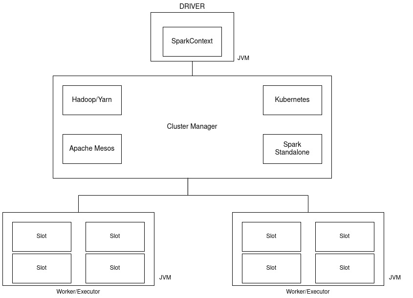

**Apache Spark** is a fast data processing engine dedicated to Big data, it allows to carry out processing on large 
volumes of data in a parallel and distributed manner.

Many of us already know about Spark but we often get confused with Spark's architecture and some of the 
key concepts associated with it.

In this article, I'll explain Spark's architecture and its key concepts.

# Spark Architecture
Spark can run on **Local** mode,  **Standalone** mode**Cluster** mode or on .

Local mode means that Spark launches all the tasks on a single JVM and the parallelism will be done according 
to the number of threads. There's no task distribution on Local mode.

This article will focus more on the Standalone and Cluster mode execution.

