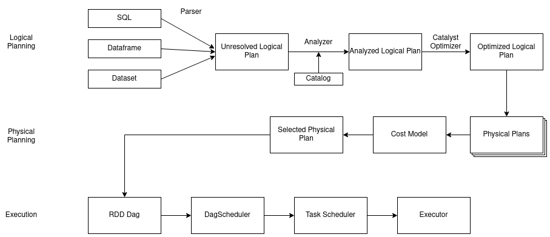
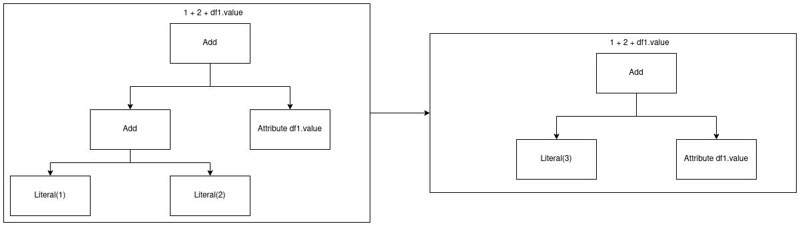
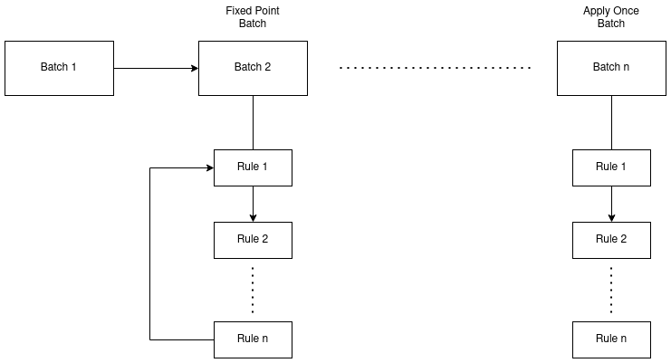
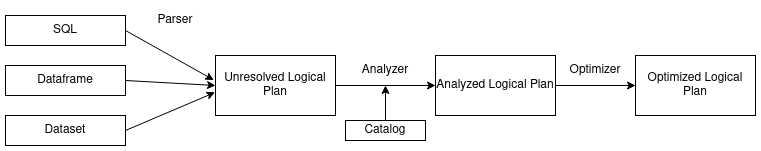
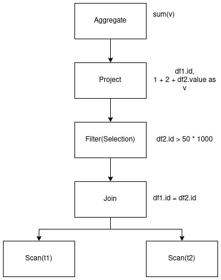
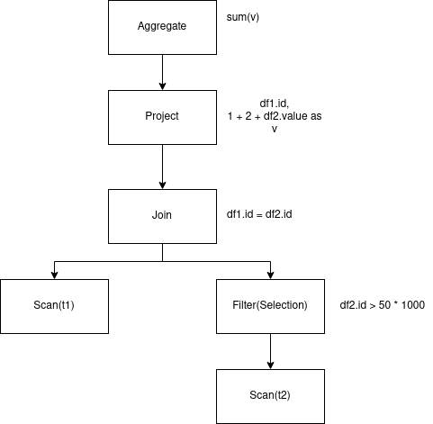
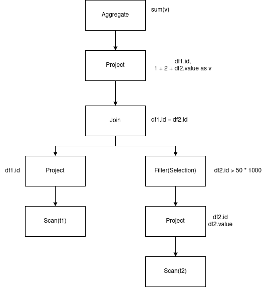

I think that we're all familiar with the Diagram below, if it's not your case, well, basically, it represents what Spark
does internally when processing data using Spark SQL.

<p align="center">
    
</p>
<p align="center">
    <em>Spark Execution Planning</em>
</p>

First, one thing to know, is that Execution planning isn't lazy evaluated. The code snippet below shows that.

```
case class Car(brand : String , name : String, maxSpeed : Int)
val carsRdd = sc.makeRDD(Seq(Car("Toyota", "Supra", 300), Car("Nissan", "GTR-R32", 300)))
val df = spark.createDataFrame(carsRdd)
df.select(col("brand"))
df.select(col("idk"))
```

Line 4 will work, but, line 5 will throw an Analysis Exception saying that column `idk` can't be resolved.
This means that the Execution plan is evaluated immediately when a transformation is applied.

# Catalyst

Catalyst is a Framework for representing and manipulating a **Dataflow graph** as Trees of Relational Operators and Expressions.

Spark >= 2.0 uses Catalyst Framework to build an extensible execution plan optimizer for Spark SQL based APIs. It supports both rule based and cost bases
optimizations.

Basically, when you process data using Spark SQL, Dataframe or Datasets API, Catalyst will parse your queries into trees, then, 
Catalyst will manipulate those trees to validate, optimize your queries and compile them to JVM's bytecode. 

It may be a bit abstract for now, but don't worry, this article's goal is to explain to you everything going under Spark's hood.

## Trees

So, trees are the main data type in Spark Execution Planning. They're parsed from a given user code of a Spark Application and 
represent a tree of relational operators of a structures query. 

Catalyst Trees are analyzed and transformed in order to validate and optimize the query execution.

### TreeNodes

TreeNodes are recursive data structures that can have zero, one or many children which themselves are TreeNodes.

It is the base class for [Expressions](#expression) and [Query Plans](#query-plan).

#### Expression

Expressions are executable TreeNodes in Catalyst Tree that can evaluate a result given a certain input values. In other terms, 
Expressions can produce a JVM object per `Internal Row`.

Catalyst Expressions have a lot of uses, few examples :
- Spark's native functions that you can find in [Spark API Reference](https://spark.apache.org/docs/latest/api/scala/org/apache/spark/sql/functions$.html).
- [Catalyst Transformations](#trees-transformations)
- [Logical Planning](#logical-plan) and [Physical Planning](#physical-plan)

Catalyst's Expression abstract class has several implementations :
- `Nondeterministic` : a deterministic expression is like a [pure function](https://en.wikipedia.org/wiki/Pure_function) in Functional Programming
- `Stateful` : an expression that contains mutable state. For example, MonotonicallyIncreasingID and Rand. A stateful expression is always non-deterministic
- `Unevaluable` : an expression that is not supposed to be evaluated (`eval`, `doGenCode` and `genCode` Expression methods are not Implemented)
- `NullIntolerant` : an expression that is null intolerant (i.e. any null input will result in null output
- `NamedExpression` : an Expression that is named 
- `Attribute` : an Expression that represents an Attribute. It's always LeafExpression, NamedExpression and NullIntolerant at the same time

#### QueryPlan

Query Plans is an abstract class for Spark's [Logical Planning](#logical-plan) and [Physical Planning](#physical-plan).
It's a tree of TreeNodes that in turn can have trees of Catalyst Expressions.
## Trees transformations

Trees transformations are defined as Partial Functions.

There two types of Tree Transformations : Same plan type and Different plan type Transformation.

### Same plan type Transformation

Transforms the tree without changing its type:
- Expression to expression
- Logical Plan to Logical Plan
- Physical Plan to Physical Plan

<p align="center">
    
</p>
<p align="center">
    <em>Tree Transformation Same Type</em>
</p>

Transformation applied in order to go from the Left tree to the right one is defined as **Constant folding** rule :
```
transform{
    case Add(Literal(x: Integer), Literal(y: Integer)) =>
        Literal(x+y)
}
```

Example showed above is a really simple one and thus, can be optimized using only one simple transformation rule. In real world scenarios,
we'd like the Spark Engine to apply multiple rules.

Actually this is what it does, is uses a **Rule Executor** to transform a tree to another tree of the same type by applying many rules in batches, and,
every rule is implemented based on its transformation.

<p align="center">
    
</p>
<p align="center">
    <em>Rule Executor</em>
</p>

**Rule Executor** has two approaches of applying rules :
- Fixed Point : apply each rule in a batch sequentially, over and over again, until the tree does not change anymore
- Apply Once : each rule in a batch is applied only once

### Different plan type Transformation

Transforms the tree to another kind of Tree, especially Logical Plan Tree to Physical Plan Tree.
This can be done using **Strategies**, it's a pattern matching that converts a Logical plan to the corresponding Physical plan.

What it actually does, it converts the nodes of the Logical tree to nodes of the Physical tree.

```
object BasicOperators extends Strategy{
    def apply(plan: LogicalPlan): Seq[SparkPlan] = plan match {
        ...
        case logical.Project(projectList, child) => 
            execution.ProjectExec(projectList, planLater(child)) :: Nil
        case logical.Filter(condition, child) =>
            execution.FilterExec(condition, planLater(child)) :: Nil
        ...
    }
}
```

The code above is a snippet of the Spark's BasicOperators Strategy which transforms basic logical tree nodes (such as Filter) to
actual physical nodes.

Often times, a single Strategy isn't enough to convert all kinds of logical plans into physical ones, so we call `planLater` which will
trigger different kind of strategies.

For the next part of the article, let's take an example to better understand what happens in the Spark Execution Planning.

```
val df1 = spark.range(10000000).toDF("id1").withColumn("name", lit("arslane"))
val df2 = spark.range(20000000).toDF("id2").withColumn("value", rand() * 10000000)
val df3 = df1.join(df2, df1("id1") === df2("id2")).filter("value > 50 * 1000").select(col("id1"), col("value").plus(1).plus(2).alias("v")).groupBy("id1").sum("v")
```

# Spark Query Execution in Action

## Logical Planning

Logical planning (c.f figure above) is the first step for the creation of the logical plan.
it describes computation on data without defining how these computations are done physically
(it does not specify join algorithms for example).

<p align="center">
    
</p>
<p align="center">
    <em>Spark Logical Planning</em>
</p>

### Unresolved Logical Plan

First Catalyst parses the code written using the Dataframe, Datasets API or in SQL into a tree which will lead to the creation of the **Unresolved Logical Plan**.

`df3` tree will be parsed into the Tree below.

<p align="center">
    
</p>
<p align="center">
    <em>Unresolved Logical Plan</em>
</p>

If we do a `df3.explain(true)` spark will return to us the unresolved/parsed logical plan.

```
== Parsed Logical Plan ==
Aggregate [id1#2L], [id1#2L, sum(v#183) AS sum(v)#189]
+- Project [id1#2L, ((value#11 + cast(1 as double)) + cast(2 as double)) AS v#183]
   +- Filter (value#11 > cast((50 * 1000) as double))
      +- Join Inner, (id1#2L = id2#9L)
         :- Project [id1#2L, arslane AS name#4]
         :  +- Project [id#0L AS id1#2L]
         :     +- Range (0, 10000000, step=1, splits=Some(8))
         +- Project [id2#9L, (rand(-9022958612971169036) * cast(10000000 as double)) AS value#11]
            +- Project [id#7L AS id2#9L]
               +- Range (0, 20000000, step=1, splits=Some(8))
```

At this point, Spark doesn't do any optimization, it just parses the code we wrote into a tree.
Also, no check is done to find out if the columns we specified exists or not, nothing is checked here, that's why it's called Unresolved.

### Resolved Logical PLan

Once we've got the Unresolved logical Plan, **Spark Analyzer** will use the Catalog to figure out where these datasets and columns come from and types of their columns.
Then, the Analyzer will verify and resolve that everything is okay (column names, data types, applicability of transformations, etc) by checking the metadata inside the Catalog.

Analyzer is a **Rule Executor**

For example, if we have these 3 lines below, Analyzer will resolve the first one, while the 2nd and 3rd will be rejected, and it will throw a `AnalysisException`.

```
df.select("id") // OK Column exists in Catalog
df.select("age") // NOT OK Column doesn't exists in Catalog
df.select(max("name")) // NOT OK cannot apply max() to a None numeric column
```

Again, if we run a `df3.explain(true)`, here's the output for the Resolved Logical Plan.

```
== Analyzed Logical Plan ==
id1: bigint, sum(v): double
Aggregate [id1#2L], [id1#2L, sum(v#183) AS sum(v)#189]
+- Project [id1#2L, ((value#11 + cast(1 as double)) + cast(2 as double)) AS v#183]
   +- Filter (value#11 > cast((50 * 1000) as double))
      +- Join Inner, (id1#2L = id2#9L)
         :- Project [id1#2L, arslane AS name#4]
         :  +- Project [id#0L AS id1#2L]
         :     +- Range (0, 10000000, step=1, splits=Some(8))
         +- Project [id2#9L, (rand(-9022958612971169036) * cast(10000000 as double)) AS value#11]
            +- Project [id#7L AS id2#9L]
               +- Range (0, 20000000, step=1, splits=Some(8))
```

As you can see, the Logical Plan slightly changes, Spark now knows what are the types of columns `id1` and `v`.
If there was a problem with the Catalog and the operations we're doing on the dataframes, Analyzer would have thrown an `AnalysisException`.

### Optimized Logical Plan

Once the Logical Plan is resolved, Catalyst Optimizer will take the initiative to actually Optimize the Logical Plan
by applying same plan type transformations.

In a nutshell, Catalyst with the help of **Rule Executor** applies **Rule-based optimization**, these rules includes : Constant folding,
Predicate push-down, Projection pruning and other rules (even user coded rules).

#### Constant Folding

Which we've already seen in [Same plan type Transformations]

#### Predicate push-down

This kind of rules optimizes where the `filter` operations happens.

By applying this rule to the tree in the `Unresolved Logical Plan` image will be transformed into the tree below :

<p align="center">
    
</p>
<p align="center">
    <em>Predicate Push-down Transformation</em>
</p>

#### Projection Pruning

This kind of rules optimizes where the `select` operations happens.

By applying this rule to the tree in the `Unresolved Logical Plan` image will be transformed into the tree below :

<p align="center">
    
</p>
<p align="center">
    <em>Predicate Push-down Transformation</em>
</p>    

After applying these transformations to the tree, Catalyst will return the tree below :

<p align="center">
    
</p>
<p align="center">
    <em>Catalyst Optimized Logical Plan</em>
</p>

If we do a `df3.explain(true)` spark will return to us the Optimized logical plan.

```
== Optimized Logical Plan ==
Aggregate [id1#2L], [id1#2L, sum(v#183) AS sum(v)#189]
+- Project [id1#2L, ((value#11 + 1.0) + 2.0) AS v#183]
   +- Join Inner, (id1#2L = id2#9L)
      :- Project [id#0L AS id1#2L]
      :  +- Range (0, 10000000, step=1, splits=Some(8))
      +- Filter (value#11 > 50000.0)
         +- Project [id#7L AS id2#9L, (rand(-9022958612971169036) * 1.0E7) AS value#11]
            +- Range (0, 20000000, step=1, splits=Some(8))
```

As you can see in the Optimized Logical Plan and on the figure **Catalyst Optimized Logical Plan**, the filter condition was
moved above the `Scan` node thanks to `Predicate push-down`. Also, the `Projection` is pushed before the `Join` operation thanks to `Projection Pruning`.

## Physical Plan

Coming soon

# References

Spark The Definitive Guide.
Josh Rosen talk https://www.youtube.com/watch?v=5ajs8EIPWGI
[Same plan type Transformations]: <#same-plan-type-transformation> "Same plan type Transformation"
